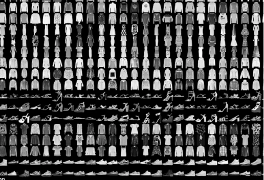

This Repo demonstrates the basics of using Keras and Tensorflow to perform simple deep learning.
We perform deep learning using Convoluntial Neural Networks on the MNIST Digit Data and we follow it up by 
creating a CNN to analysis the multioutput MNIST Fashion Data set.

We also incorporate Max Pooling to improve our results, and callbacks to provide information on convergence. 

Image Citation: https://www.kaggle.com/zalando-research/fashionmnist
